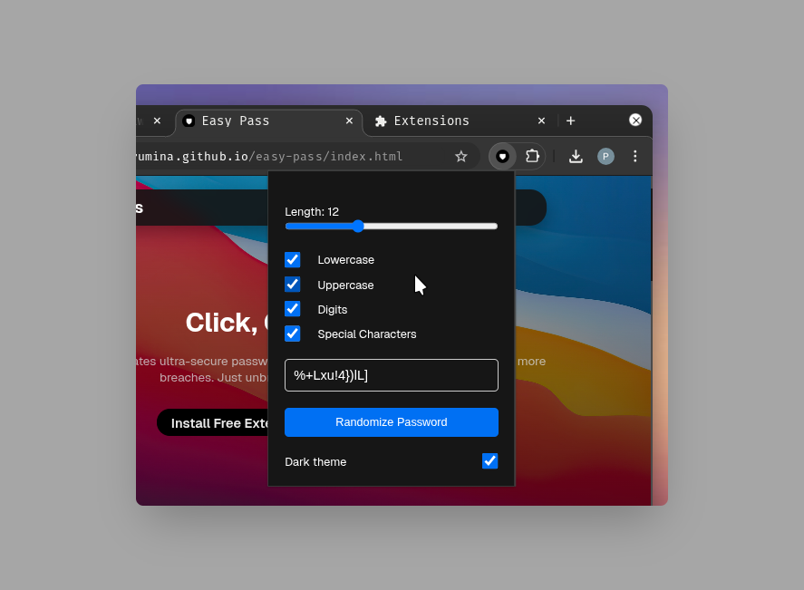

# easy-pass

Easy Pass is a secure, offline password generator extension. Create strong, unique passwords instantly with customizable options—length, symbols, numbers, and more. No internet, no tracking, no ads—just a fast, private, and simple tool for better password management.

- 
- 